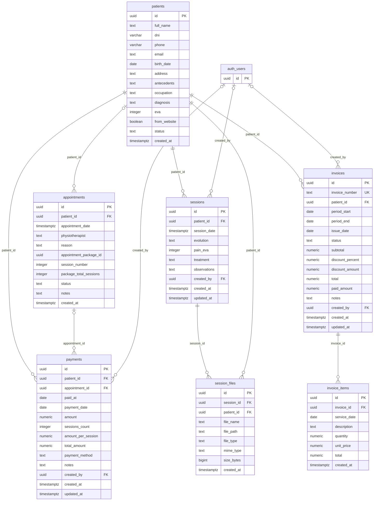

# Modelo entidad-relación — Base de datos de TherapyFlex

## Criterio de lectura

Modelo de las siete tablas de negocio declaradas en el repositorio y su referencia externa a `auth.users` (dibujada como auth_users, mostrando únicamente su clave). No se ha inspeccionado la base de datos desplegada. Los tipos con precisión se simplifican en el dibujo; consultar sus definiciones completas en los SQL.

Se usan las definiciones CREATE TABLE de patients y appointments en `db/script.sql`, sessions y session_files en `db/clinical_history.sql`, payments en `db/payments.sql`, e invoices e invoice_items en `db/billing.sql`.

## Relaciones y cardinalidades

| Padre | Hija y FK | Padre por cada hija | Al eliminar el padre |
|---|---|---|---|
| patients | appointments.patient_id | Cero o uno | CASCADE |
| patients | sessions.patient_id | Uno en la definición nueva | CASCADE |
| sessions | session_files.session_id | Uno | CASCADE |
| patients | session_files.patient_id | Uno | CASCADE |
| patients | payments.patient_id | Uno en la definición nueva | RESTRICT |
| appointments | payments.appointment_id | Cero o uno | SET NULL |
| patients | invoices.patient_id | Uno | RESTRICT |
| invoices | invoice_items.invoice_id | Uno | CASCADE |
| auth.users | sessions.created_by | Cero o uno | NO ACTION por defecto |
| auth.users | payments.created_by | Cero o uno | NO ACTION por defecto |
| auth.users | invoices.created_by | Cero o uno | NO ACTION por defecto |

Cada padre puede tener cero o muchas filas hijas. PK = clave primaria; FK = clave foránea; UK = clave única. `||` indica uno; `|o` indica cero o uno; `o{` indica cero o muchos.

## Diferencias entre scripts

CREATE TABLE IF NOT EXISTS y ADD COLUMN IF NOT EXISTS no reemplazan columnas o restricciones existentes. Si se ejecutó primero `db/script.sql`:

- sessions.patient_id puede seguir admitiendo NULL; session_date puede continuar como DATE; treatment, evolution y created_at pueden conservar la nulabilidad original.
- payments.patient_id puede seguir admitiendo NULL y conservar ON DELETE CASCADE en lugar de RESTRICT. payment_method puede seguir admitiendo NULL y amount conservar su definición original.
- Los CHECK de sessions_count, amount_per_session y total_amount aparecen en CREATE TABLE de payments, pero no en las respectivas adiciones de columnas.

El diagrama usa la definición nueva de los módulos. Las relaciones obligatorias desde sessions y payments hacia patients pueden ser opcionales en una instalación creada con el script base. Confirmar esta diferencia exige consultar las restricciones del servidor.

## Límites del esquema actual

- physiotherapist es texto en appointments; los scripts no declaran una tabla de fisioterapeutas.
- appointment_package_id agrupa citas sin FK a una tabla de paquetes.
- sessions no tiene appointment_id: las sesiones clínicas y las citas comparten paciente, sin FK directa entre ellas.
- payments no tiene invoice_id. invoices.paid_amount es un valor almacenado, no una relación con payments.
- invoice_items no referencia citas ni un catálogo de servicios.
- session_files.file_path es una ruta, sin FK a storage.objects. El script clínico configura el bucket clinical-files.
- Las FK separadas de session_files y payments no garantizan por sí solas que el paciente coincida con el de la sesión o cita referenciada.
