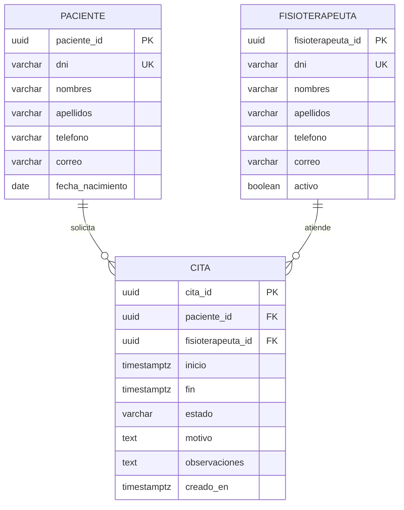

# Centro de Fisioterapia — Sistema de citas para pacientes
**Curso:** Modelamiento de Datos  
**Proyecto de referencia:** TherapyFlex  
**Estudiante(s):** Por completar  
**Docente:** Por completar  
**Fecha de presentación:** Por completar
## 1. Descripción del caso
Un centro de fisioterapia necesita organizar las citas de sus pacientes y la agenda de sus fisioterapeutas. Para cada atención, debe conocer quién asistirá, qué profesional atenderá, cuándo comenzará y terminará la cita y cuál es su estado.
Si esta información se administra en registros separados, pueden producirse duplicación de pacientes, cruces de horarios y dificultades para consultar las próximas atenciones. Se propone una base de datos relacional que centralice la información y mantenga relaciones consistentes entre pacientes, profesionales y citas.
Este documento presenta una **propuesta académica** basada en TherapyFlex. No describe una migración ya aplicada ni garantiza que todas las reglas propuestas estén implementadas en el sistema actual.
## 2. Objetivos
### Objetivo general
Diseñar un modelo de datos relacional para gestionar las citas de pacientes de un centro de fisioterapia, asegurando la integridad de la información y evitando conflictos de agenda.
### Objetivos específicos
- Identificar las entidades, atributos, claves y relaciones del proceso de reserva.
- Registrar los datos de contacto de pacientes y fisioterapeutas.
- Organizar las citas por paciente, profesional, fecha y estado.
- Definir reglas para programar, reprogramar y cancelar citas.
- Aplicar normalización hasta la tercera forma normal al modelo propuesto.
## 3. Alcance y actores
El alcance comprende el registro de pacientes y fisioterapeutas, la programación de citas, su reprogramación, cancelación y consulta. El paciente solicita una cita; recepción la registra y administra; el fisioterapeuta consulta su agenda y registra el resultado de la atención; el administrador mantiene los registros de profesionales.
Quedan fuera de este modelo inicial la facturación, los pagos, las historias clínicas, los paquetes de sesiones y la gestión detallada de turnos laborales. Aunque TherapyFlex incluye información adicional, aquí se delimita el caso al sistema de citas.
## 4. Requerimientos de información
| Código | Requerimiento |
|---|---|
| RF01 | Registrar y consultar pacientes y sus datos de contacto. |
| RF02 | Registrar fisioterapeutas y marcar si están activos. |
| RF03 | Programar una cita asociada a un paciente y un fisioterapeuta. |
| RF04 | Consultar las citas de un paciente y la agenda de un profesional. |
| RF05 | Reprogramar una cita conservando su identificador. |
| RF06 | Cambiar el estado de una cita y conservar las citas canceladas. |
| RF07 | Evitar citas que se superpongan para un mismo profesional o paciente. |
## 5. Reglas de negocio
1. Cada paciente y fisioterapeuta tiene un identificador único.
2. Cada cita pertenece exactamente a un paciente y a un fisioterapeuta.
3. Un paciente puede existir sin citas y tener múltiples citas a lo largo del tiempo.
4. Un fisioterapeuta puede existir sin citas y atender múltiples citas en horarios diferentes.
5. La fecha y hora de fin de una cita deben ser posteriores a su inicio.
6. Los estados permitidos son: `programada`, `confirmada`, `atendida`, `cancelada` y `no_asistio`.
7. Dos citas no canceladas no pueden superponerse para un mismo paciente ni para un mismo fisioterapeuta. Se consideran intervalos [inicio, fin): una cita puede comenzar cuando termina la anterior.
8. Solo se pueden asignar nuevas citas a fisioterapeutas activos.
9. Cancelar una cita cambia su estado; no elimina el registro.
10. No se permite eliminar pacientes o fisioterapeutas que tengan citas asociadas.
11. Para este ejercicio se utiliza DNI de ocho dígitos, opcional para pacientes y obligatorio para fisioterapeutas; cuando se registra debe ser único dentro de su entidad. Otros documentos quedan como ampliación futura.
12. Una cita programada puede confirmarse o cancelarse. Una cita programada o confirmada puede marcarse como atendida o como inasistencia. Solo las programadas o confirmadas pueden reprogramarse.
## 6. Modelo conceptual
| Entidad | Descripción |
|---|---|
| PACIENTE | Persona que solicita una atención de fisioterapia. |
| FISIOTERAPEUTA | Profesional responsable de atender una cita. |
| CITA | Reserva de un intervalo de tiempo para atender a un paciente. |
Relaciones y cardinalidades:
- **PACIENTE — CITA:** uno a muchos (1:N). Un paciente tiene cero o muchas citas; cada cita tiene un único paciente.
- **FISIOTERAPEUTA — CITA:** uno a muchos (1:N). Un profesional atiende cero o muchas citas; cada cita tiene un único profesional.
- Pacientes y fisioterapeutas se relacionan a través de CITA: un paciente puede atenderse con distintos profesionales y un profesional puede atender distintos pacientes.

El diagrama puede visualizarse en un visor Markdown con soporte Mermaid. PK significa clave primaria; FK, clave foránea; UK, clave única.
## 7. Modelo lógico y diccionario de datos
```text
PACIENTE(paciente_id PK, dni UK, nombres, apellidos, telefono, correo,
         fecha_nacimiento)
FISIOTERAPEUTA(fisioterapeuta_id PK, dni UK, nombres, apellidos,
               telefono, correo, activo)
CITA(cita_id PK, paciente_id FK → PACIENTE,
     fisioterapeuta_id FK → FISIOTERAPEUTA,
     inicio, fin, estado, motivo, observaciones, creado_en)
```